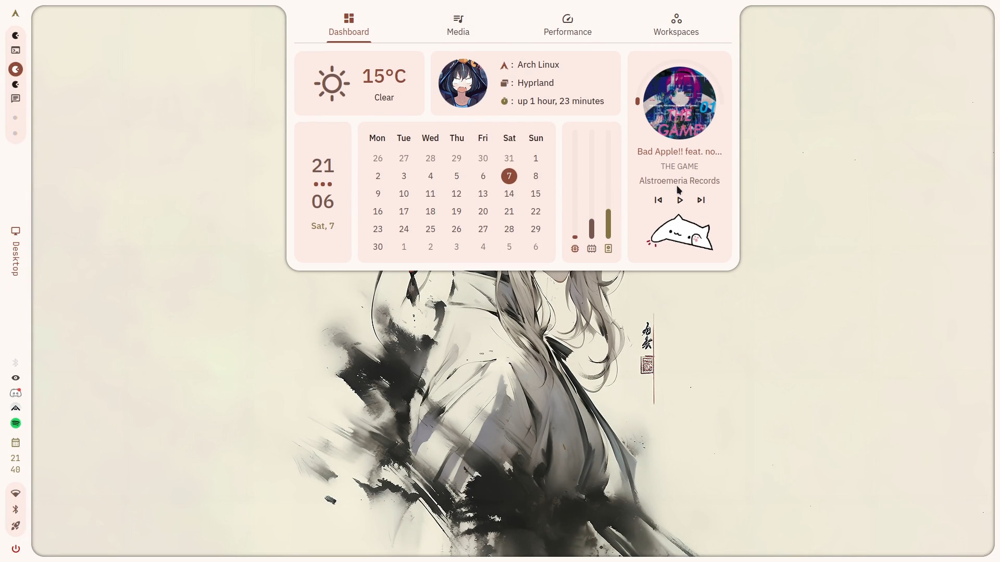

# awesome-quickshell
A collection of great quickshell shells! Thanks for the idea Flatbread1!

## Featured Shells
1. [DankMaterialShell](#dankmaterialshell) – Very professional shell
2. [Ambxst](#ambxst) – Impressive customization
3. [Noctalia Shell](#noctalia-shell) – Very user-friendly shell

**Legend for tags**
- `hyprland`, `sway`, `niri`, `...` – target platform
- `material` – follows Material Design
- `apple` – follows Apple Design
- `unique` – unique design / new features
- `ai` – integrates AI tools
- `lightweight` – minimal system usage
- `user-friendly` – beginner-friendly
- `customizable` – highly configurable

### [Whisker](https://github.com/corecathx/whisker)
`hyprland` `material` `user-friendly`
> A simple shell for  Hyprland, focusing on usability and customization (and cats).

### [HyprZepyx](https://github.com/xZepyx/hyprzepyx)
`hyprland` `lightweight`
> A robust, high-performance Hyprland configuration, focused on workflow efficiency, customization, and a refined visual experience for developers and advanced Linux users.

### [Amadeus](https://github.com/xfcasio/amadeus)
`hyprland` `unique`
> Description TBD

### [Nucleus Shell](https://github.com/xZepyx/nucleus-shell)
`hyprland` `material` `lightweight`
> A shell built to get things done

### [NibrasShell](https://github.com/AhmedSaadi0/NibrasShell)
`hyprland` `material`
> Quickshell Hyprland shell with smart widgets and rich theming

### [Aureli](https://github.com/eq-desktop/eqsh)
`hyprland` `apple` `AI` `unique`
> Your Polished AIO Hyprland Shell. Built for maximum efficiency and a better workflow

### [Ambxst](https://github.com/Axenide/Ambxst)
`hyprland` `customizable` `unique`
> An Axtremely customizable shell

### [caelestia-shell](https://github.com/caelestia-dots/shell)
`hyprland` `material` `user-friendly`
> A polished, modular desktop shell for Hyprland with a material-inspired aesthetic.

### [ChromeX](https://github.com/catdeal3r/chromex)
`niri` `material`
> A ChromeOS recreation for Linux, built with Quickshell.

### [DankMaterialShell](https://github.com/AvengeMedia/DankMaterialShell)
`niri` `hyprland` `mangowc` `sway` `labwc` `scroll` `material` `user-friendly`
> A modern desktop shell for Wayland

### [illogical-impulse](https://github.com/end-4/dots-hyprland)
`hyprland` `material` `customizable` `AI` `heavy` `user-friendly`
> Usability-first dotfiles with a corporate-ish-level cleanliness

### [Noctalia shell](https://github.com/noctalia-dev/noctalia-shell)
`hyprland` `niri` `sway` `mangowc` `labwc` `customizable` `user-friendly`
> A sleek and minimal desktop shell thoughtfully crafted for Wayland.

### [Sleex](https://www.axos-project.com/docs/guides/sleex)
`hyprland` `AI` `material`
> The shell of the third desktop environement of AxOS

### [Zaphkiel](https://github.com/Rexcrazy804/Zaphkiel)
`mangowc` `material`
> Nixos configuration feat. kurukurubar

## Contributing
Feel free to open a PR to add new shells.
Requirements:
- Must be Quickshell-based
- Public repository or documentation
- Screenshot included
- A short description and tags are added